# Portfolio README.md
---

 ## LINKS

 Portfolio website:
 https://chrischongportfolio.netlify.app/

 GitHub Repo:
 https://github.com/chrismyhub/portfolio_website

---

## DESCRIPTION OF PORTFOLIO WEBSITE
<u>PURPOSE</u>
 
The purpose of this portfolio website is to introduce potential employers to myself and give them reason to engage me as their web developer.  It will link to my GitHub account where they can explore the various projects I have been involved in.  It will also link to my Linkedin account where they can find more information about my professional working career.  My blogs page will allow them to read more about my interests and see where my heads at.  I will also provide contact details to make it easier to connect with me.  
 
 
<u>FUNCTIONALITY / FEATURES</u>
 
 

Concept behind the design/layout:
- The idea is based on simplicity and focused information.  This is to enable the user to see the information as clearly as possible. 
- The semi-transparent navigation/menu and footer bars are intended to give a feeling of space when visiting the website.  Also to reflect the idea that this is the world through my lens, which is not black and white.

Navigation/Menu Bar:
- This stays fixed on the top of every page and does not move when the user scrolls down the page.  This is to allow easy and quick access to other pages.
- When viewed on a mobile device, the menu bar appears stacked vertically.  As the screen size increases, the menu bar opens up with it to maximise screen real estate.
 
 

Page links:
- Each page of the portfolio website is linked to one another.
- On every page there is a clear link to the other pages at the top of the window under 'Menu'.
- Link to my GitHub account, at the footer of each page, to allow user easy access to view my collection of projects.
- Link to my Linkedin account, at the footer of each page, to provide user more information on my professional working career.
- Link to download a PDF copy of my Resume, on the 'Work History' pages, to provide user details of my work experience.  Some browsers will open this PDF into a new tab to view instantly, others will simply download the file for viewing in another program.
 
 

Contact Details:
- These are fixed on the footer of each page, to allow user to easily connect with me via Email and Mobile.
 
 

Copyright details:
- Fixed on the footer of each page for easy reference.

 
 
<u>SITEMAP</u>
 
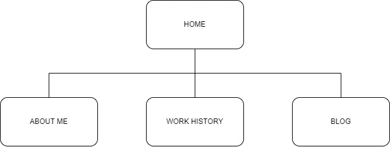
 
 
<u>SCREENSHOTS</u>
 
Desktop Screen (1440x900):
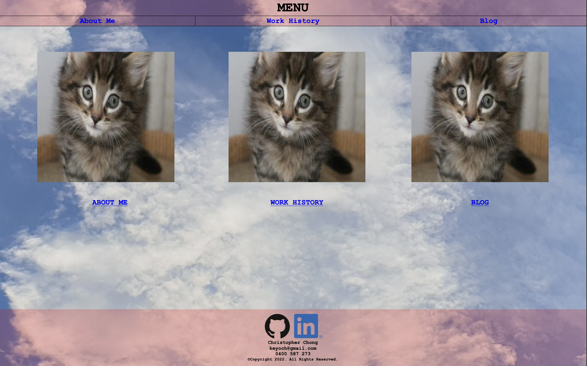
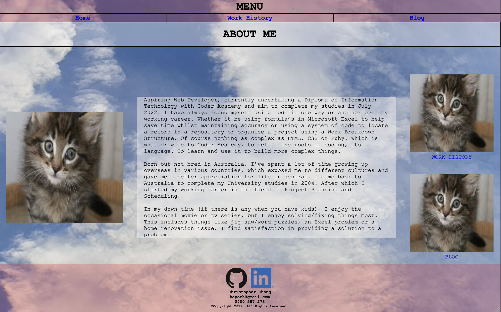
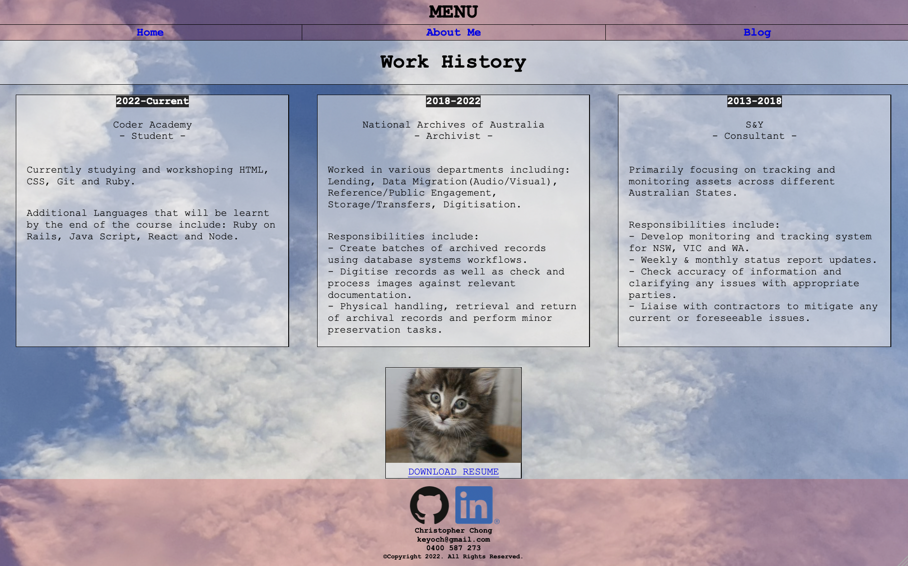
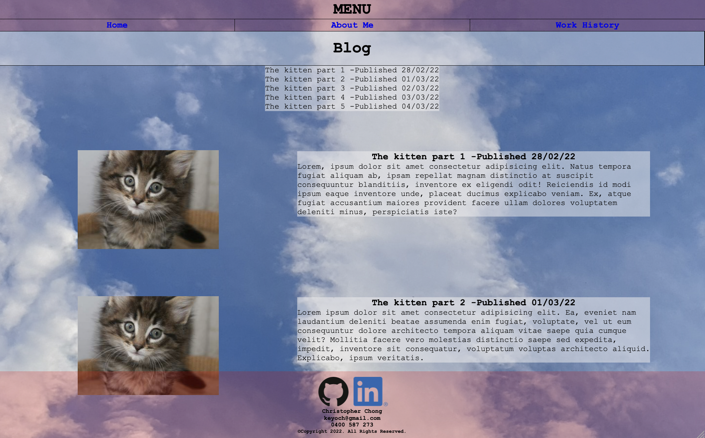
 
Tablet Screen (810x1080):
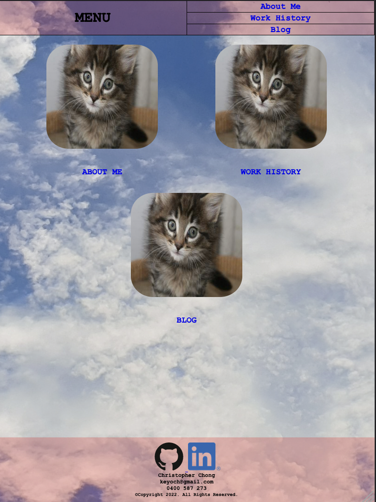
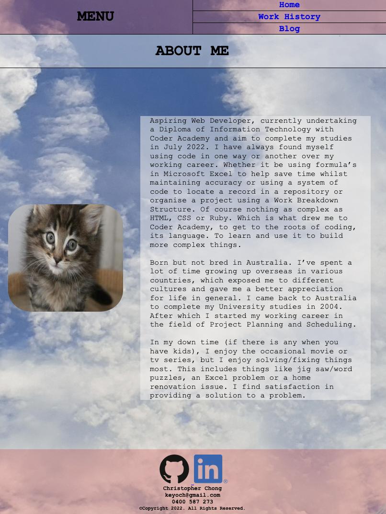
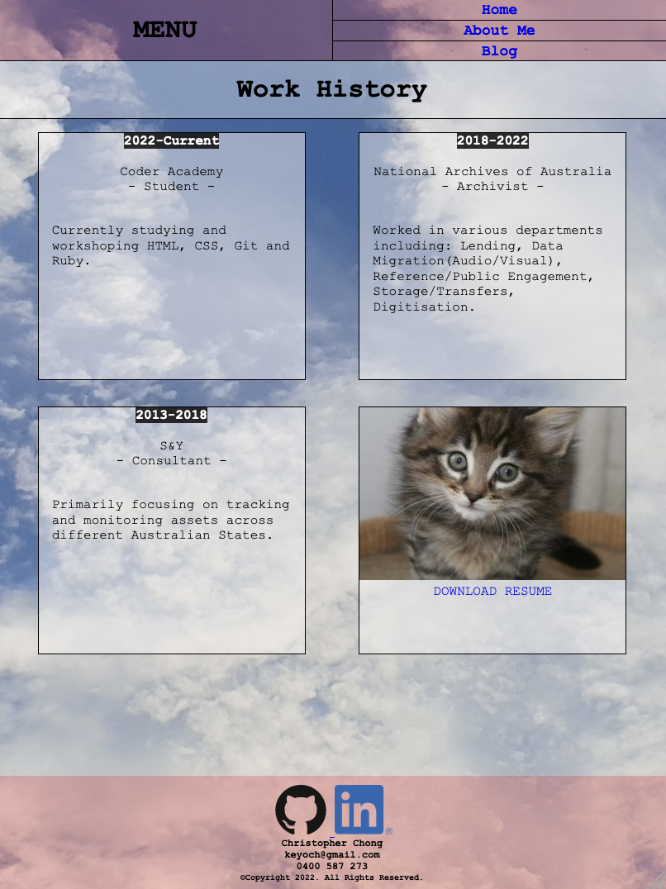
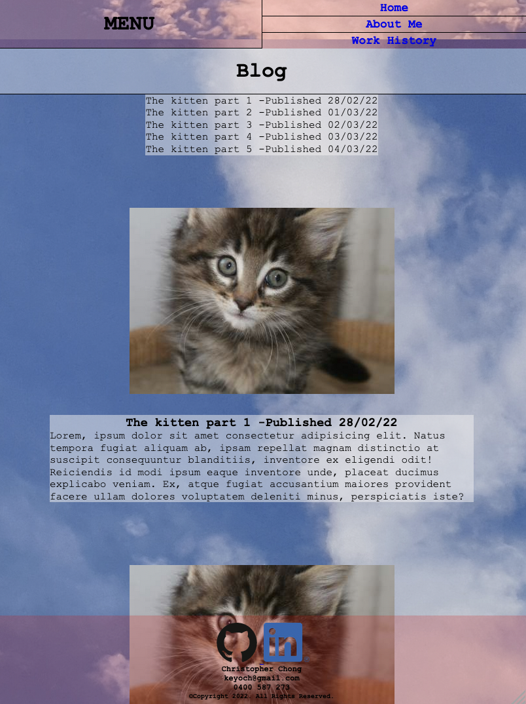
 
Mobile Screen (360x740):

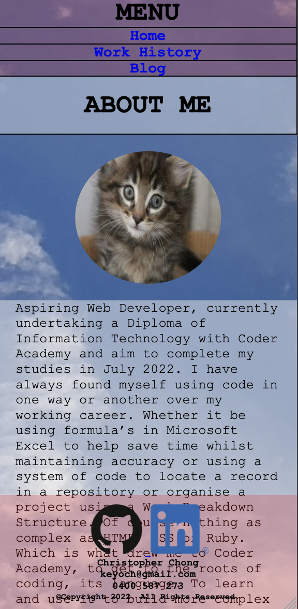

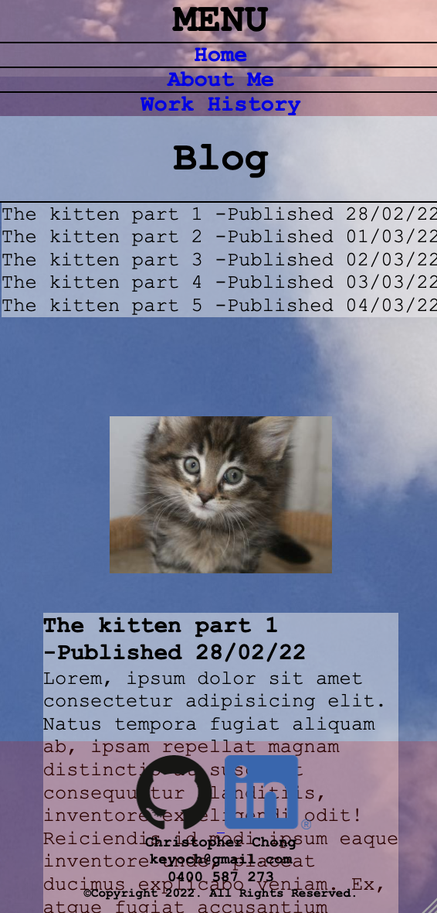
 
 
<u>TARGET AUDIENCE</u>
 
This portfolio is aimed at potential employers, who are technically inclined in this field and are looking to engage an Information Technology professional with Web Development skills.
 
 
<u>TECH STACK</u>
- HTML5
- CSS 3
- Deployment Platform: Netlify

 